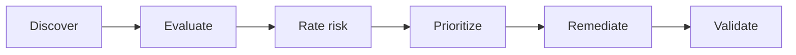

# Telehealth Cybersecurity Assessment

> A consulting-style cybersecurity maturity and audit-readiness assessment for a growing telehealth company.

**Status:** Portfolio migration and enhancement  
**Client:** Northstar Telehealth Solutions *(fictional)*  
**Primary roles demonstrated:** Cybersecurity Consultant · GRC Analyst · Security Assessor

## Executive Summary

Northstar has expanded quickly, adding remote employees, cloud services, endpoints, partners, and sensitive healthcare workflows. Leadership needs a clear view of cybersecurity risk, prioritized remediation, and evidence required for future audits and customer reviews.

This project evaluates governance, identity, endpoints, network security, data protection, incident response, resilience, and third-party risk. Findings are translated into an actionable roadmap instead of a compliance-only checklist.

## Assessment Objectives

- Identify control and process gaps
- Evaluate the likelihood and business impact of risk scenarios
- Map observations to recognized security practices
- Separate urgent exposure from longer-term maturity improvements
- Assign owners, priorities, and target dates
- Give leadership a clear decision-oriented summary
- Establish an evidence plan for audit readiness

## Assessment Scope

| Domain | Example review areas |
|---|---|
| Governance | Policies, ownership, risk process, metrics |
| Identity and access | MFA, lifecycle, privilege, access reviews |
| Endpoint security | Inventory, configuration, encryption, patching, EDR |
| Network security | Segmentation, remote access, firewall governance |
| Data protection | Classification, encryption, retention, DLP |
| Vulnerability management | Scanning, prioritization, remediation |
| Incident response | Roles, playbooks, communications, exercises |
| Resilience | Backups, recovery objectives, continuity testing |
| Third parties | Due diligence, contracts, monitoring, offboarding |
| Awareness | Training, phishing resilience, role-specific education |

## Methodology



1. Review scope, business drivers, systems, and sensitive data.
2. Interview fictional stakeholders using a repeatable question set.
3. Examine representative evidence.
4. Compare current practices with selected control expectations.
5. Record findings and risk scenarios.
6. Prioritize remediation by likelihood, impact, effort, and dependency.
7. Present executive and technical views.
8. Track closure and validate evidence.

## Risk Rating Model

```text
Inherent Risk = Likelihood × Impact
Residual Risk = Risk remaining after current controls
Priority considers residual risk, compliance exposure, dependencies, and effort.
```

Each finding will include:

- Observation and supporting evidence
- Affected asset, process, or data
- Threat and business-impact narrative
- Existing controls
- Likelihood and impact
- Recommended treatment
- Owner and target timeframe
- Validation evidence
- Residual risk

## Planned Deliverables

- Executive assessment report
- Current-state maturity summary
- Risk register
- Control gap matrix
- Identity and endpoint deep dives
- Policy set
- Remediation roadmap
- Compliance dashboard
- Audit-readiness checklist
- Final stakeholder presentation

## Roadmap Horizons

| Horizon | Purpose |
|---|---|
| 0–30 days | Address critical exposure and establish ownership |
| 31–90 days | Implement foundational controls and repeatable processes |
| 3–6 months | Improve integration, monitoring, and evidence quality |
| 6–12 months | Mature governance, testing, automation, and metrics |

## Success Measures

- Every high-priority finding has an accountable owner
- Recommendations include measurable acceptance criteria
- Identity, endpoint, and network risks connect to technical projects
- Leadership can distinguish immediate risk from maturity investment
- Audit evidence has a defined source, owner, and review frequency
- Closed findings are independently validated

## Repository Roadmap

- [ ] Migrate and sanitize existing assessment artifacts
- [ ] Add executive summary and organization profile
- [ ] Finalize risk and control methodology
- [ ] Publish risk register and gap matrix
- [ ] Add prioritized roadmap and dashboard
- [ ] Build audit-readiness checklist
- [ ] Add presentation and lessons learned

## Planned Repository Structure

```text
executive-summary/  Leadership-facing results
assessment/         Scope, methodology, interviews, and findings
risk-register/      Rated risks and treatment tracking
controls/           Control mapping and evidence requirements
policies/           Sanitized policy documents
roadmap/            Priorities, owners, timing, and dependencies
audit-readiness/    Evidence checklist and validation
presentation/       Final consulting presentation
```

## Connected Technical Projects

- [Entra ID Enterprise Implementation](https://github.com/sclem34/entra-id-enterprise-implementation)
- [Intune Secure Endpoint Deployment](https://github.com/sclem34/intune-secure-endpoint-deployment)
- [Secure Enterprise Network Lab](https://github.com/sclem34/secure-enterprise-network-lab)

## Disclaimer

This portfolio case study uses a fictional organization and sanitized information. It does not contain protected health information, employer data, or client-confidential material.
